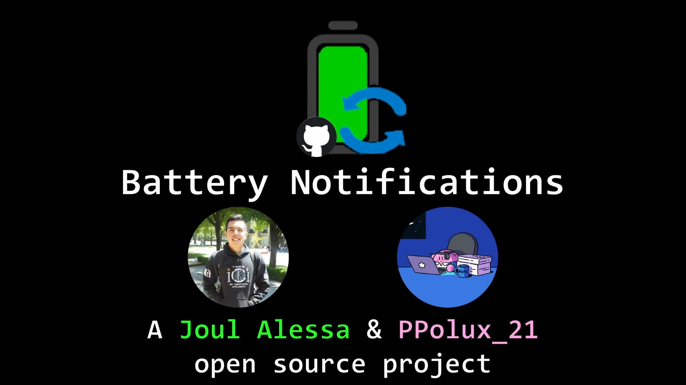

<p align="center"></p>

<h1 align="center">Battery Notifications</h1>

<div align="center">
  <strong>:battery: Battery stress, under control. :battery:</strong><br>
  App that alerts you when your battery reaches critical stress levels.<br>
</div>

<div align="center">
  <!-- License -->
  <a href="LICENSE">
    
  </a>
  <!-- Downloads total -->
  <a href="https://github.com/Joul-Alessa/Battery-Notifications/releases">
    
  </a>
  <!-- Downloads latest release -->
  <a href="https://github.com/Joul-Alessa/Battery-Notifications/releases/latest">
    
  </a>
</div>

<h2 align="center">Introduction</h2>

By making improper use of my laptop's battery charge, I have caused significant deterioration to the point that the battery is now in a severely damaged state.

Even though this component can be replaced with a new one, I found that my laptop, **which runs on Windows 11**, has a way of notifying the user when the battery is running low. However, it does not have a way to notify the user when the battery is about to reach 100%, which is the case that has caused the deterioration of my battery.

This is why I decided to automate this process with a Python script and be alerted to plug or unplug the device when the battery approaches very low or very high levels, respectively and to develop the solution together with my brother [PPolux21](https://github.com/PPolux21), working side by side to automate this task.

The goal of this development was to detect if the computer's battery reached a minimum limit to plug it in, or a maximum limit to unplug it, and notify the user through a desktop and audible notification on the computer, as well as a notification to the user's phone implemented through a service. Some alternatives considered and discarded included WhatsApp, Discord, e-mail, or SMS.

<h2 align="center">Usage</h2>

1. First, download the installer of your choice from the Releases section of this repository.
2. Run the installer with the desired configurations available in the installer.
3. Once execution starts, an icon will appear in the notification tray.
4. By right-clicking on it, you can either terminate the execution or open the project’s configuration window.
5. You can configure maximum and minimum values, sounds, Telegram integration, and the sleep interval between alerts.
6. For Telegram integration, it is necessary to obtain the Chat ID (without including the "#" sign) to which messages will be sent, as well as the Telegram bot token that will be used to send the messages (to create your own bot, it is recommended to use the BotFather assistant).
7. A shortcut can be created in the startup folder (accessible by typing ```shell:startup``` in the Run window, which opens with the ```Win + R``` shortcut) for automatic startup when the system boots.

For a visual demonstration of installation, usage, Telegram configuration, startup setup, and troubleshooting errors caused by system confusion, please refer to the following attached video showing these steps:

[](https://www.youtube.com/watch?v=9fiMhlogMwk)

<h2 align="center">Technical notes about the development</h2>

- Python was used to carry out the automation task.
- The ```psutil``` library was used to check the battery level and whether it was charging or not.
- The ```notify-py``` library was used to send notification messages to the computer.
- The ```requests``` library was used to make a request through the Telegram API to a custom bot that would send another notification to our chats.
- The ```playsound``` library (version 1.2.2 beacuse the latest version doesn't play the sound) was used to play a sound as part of the computer's notification.
- The ```signal``` library was used to check signals sent to the system and recognize the end of the program's execution, allowing a notification to be sent at that point.
- The ```dotenv``` library was used to store sensitive information in a file external to the developed code.
- The ```argparse``` library was used to support console arguments and make the automation of this task more customizable.
- Telegram and its API, as well as its bot development extension, were used in the objective section to send this notification to the user's phone.

We compiled the Python file as an executable file using PyInstaller with the following command:

```bash
py -3.13 -m PyInstaller BatteryNotifications-English.py
```

We also used Inno Setup to then turn this executable file into an installer easy for everyone to download and begin its usage.